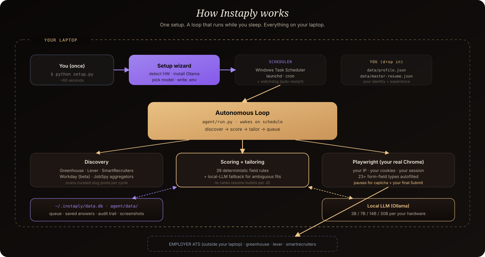
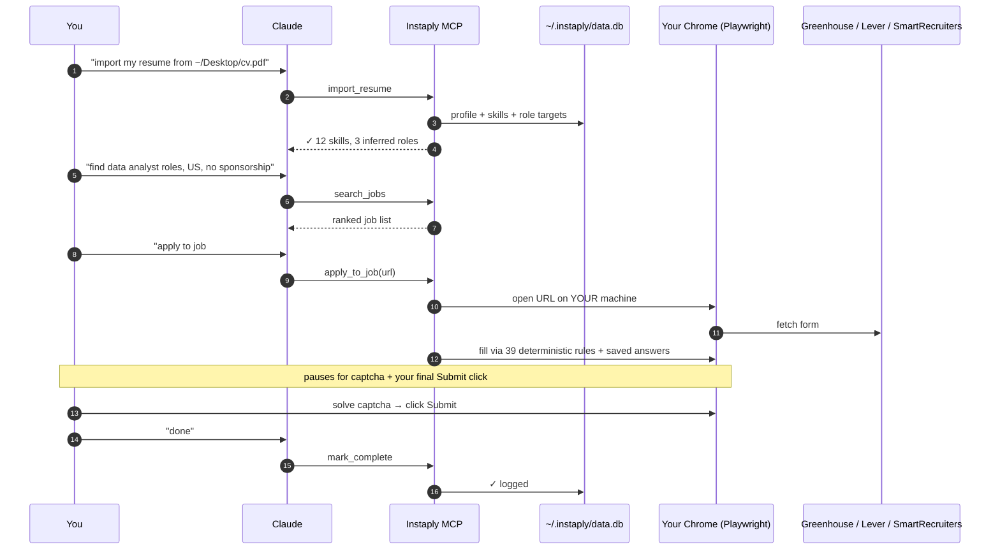
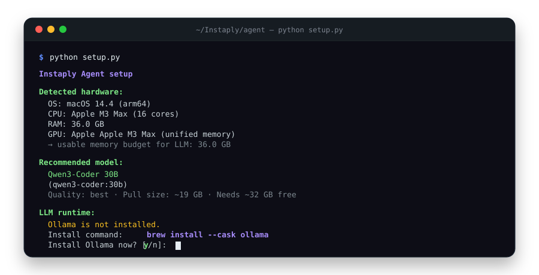

<div align="center">


<br /><br />

# 🪐 Instaply

### Apply to jobs from inside Claude.<br/>Your laptop, your browser, your data.

<br />

[](https://pypi.org/project/instaply-mcp/)
[](https://pypi.org/project/instaply-mcp/)
[](LICENSE)
[](https://github.com/Aditya-00a/Instaply/stargazers)

[](https://www.python.org/)
[](https://modelcontextprotocol.io/)
[](https://playwright.dev/)
[](CONTRIBUTING.md)

<br />

**[⚡ Install](#-install-in-30-seconds)** · **[🧠 How it works](#-how-it-works)** · **[💛 Why this exists](#-why-this-exists)** · **[🛡️ Privacy](#%EF%B8%8F-privacy)** · **[🤝 Contributing](CONTRIBUTING.md)**

<br />

</div>

> [!TIP]
> **Claude Desktop user?** Skip the rest of this README. [⬇️ Download `instaply.mcpb`](https://instaply.asion.ai/instaply.mcpb), double-click to install, and start saying *"apply to this job"* in Claude.

<br />

---

## ⚡ Install in 30 seconds

Instaply is an **MCP server**. It plugs into any local MCP-aware app — pick yours below.

<table>
<tr>
<td width="33%" align="center" valign="top">

### 🟣 Claude Desktop
*One click — no terminal*

[**⬇️ Download `instaply.mcpb`**](https://instaply.asion.ai/instaply.mcpb)

Double-click the file → done.<br/>Anthropic's official bundle format.

</td>
<td width="33%" align="center" valign="top">

### ⌨️ Claude Code
*One command*

```bash
claude mcp add instaply \
  -- uvx instaply-mcp
```

Auto-updates on every launch.

</td>
<td width="33%" align="center" valign="top">

### 🌐 Cursor · Codex · Windsurf · Zed
*One JSON snippet*

```json
{
  "mcpServers": {
    "instaply": {
      "command": "uvx",
      "args": ["instaply-mcp"]
    }
  }
}
```

</td>
</tr>
</table>

<details>
<summary><b>Plain Python fallback</b> (if you don't want uvx)</summary>

```bash
pip install instaply-mcp
python -m instaply_mcp
```

Then point your MCP client at `python -m instaply_mcp` instead of `uvx instaply-mcp`.

</details>

> [!IMPORTANT]
> Instaply needs a **real local browser**. It will not work inside Claude.ai (web), ChatGPT.com, or Codex Cloud — those sandboxes can't open Chrome. **By design.** Your residential IP is the whole reason captcha walls don't fire.

<br />

---

## 💛 Why this exists

<table>
<tr>
<td width="120px" align="center" valign="top">


</td>
<td valign="top">

> I'm **Aditya**. I'm an Indian student at NYU studying Risk Analytics. Last fall I sent out **more than 1,300 job applications** because I needed visa sponsorship and most companies filter international candidates out before a human ever sees the resume.
>
> I started writing little Python scripts so I wouldn't drown. They got better. Eventually they could read job descriptions, fill forms, and click submit. **I started landing interviews.**
>
> For a few weeks I tried to turn this into a paid SaaS. Then I realized — *the people who need this most are the people who can least afford another monthly charge.* So I'm giving the engine away. **MIT. Free forever.** Runs entirely on your laptop.
>
> If it helps you land a job, that's the whole point. If you want to give back, [open an issue](https://github.com/Aditya-00a/Instaply/issues/new) titled *"Got the job."* That's the only metric I track.
>
> — *[Aditya Sanjay Sakhale](https://github.com/Aditya-00a) · NYU MS Risk Analytics '26*

</td>
</tr>
</table>

[**Read the full story →**](https://instaply.asion.ai)

<br />

---

## 🧠 How it works

<div align="center">

</div>

<br />

A typical chat with Claude, end-to-end:



<br />

---

## 🆚 vs the other tools

|  | 🪐 **Instaply** | 💸 Paid SaaS agents | 🪟 Browser extensions |
|---|:---:|:---:|:---:|
| **Price** | **$0** · MIT | $30–80 / month | Often free, then upsell |
| **Captcha** | ✅ You solve, in your own browser | ❌ Bot detection often blocks | ⚠️ Inconsistent |
| **Your data** | ✅ Local SQLite, zero servers | ☁️ Their cloud | ☁️ Their cloud |
| **Source code** | ✅ MIT, on GitHub | ❌ Closed | ❌ Closed |
| **Works in Claude** | ✅ Native MCP | ❌ Separate app | ❌ Separate app |
| **Account required** | ❌ None | ✅ Always | ✅ Usually |

<br />

---

## 🛠️ The 12 tools Claude gets

<table>
<tr>
<th align="left">Tool</th>
<th align="left">What it does</th>
</tr>
<tr><td><code>import_resume</code></td><td>Parse a PDF / DOCX / TXT resume into a structured profile + role targets</td></tr>
<tr><td><code>apply_chat_update</code></td><td>Natural language: <em>"save my phone as 555-…"</em>, <em>"mark application 3 done"</em></td></tr>
<tr><td><code>update_profile</code> · <code>get_profile</code></td><td>Read / write the local profile</td></tr>
<tr><td><code>search_jobs</code></td><td>Public job sources; falls back to resume-derived queries when no query is given</td></tr>
<tr><td><code>save_answer</code> · <code>list_answers</code> · <code>delete_answer</code></td><td>Reusable screening-answer vault (<em>"Why do you want to work here?"</em> → answered once, reused forever)</td></tr>
<tr><td><code>apply_to_job</code></td><td>Opens local Chrome, fills the form, pauses for captcha + Submit</td></tr>
<tr><td><code>list_applications</code> · <code>get_status</code></td><td>Local audit trail + counters</td></tr>
<tr><td><code>mark_complete</code></td><td>Close the loop after you click Submit</td></tr>
</table>

Source lives in [`mcp/`](./mcp).

<br />

---

## 🛡️ Privacy

<table>
<tr>
<th align="left">What</th>
<th align="left">Where</th>
<th align="left">Who sees it</th>
</tr>
<tr><td>Resume + extracted profile</td><td><code>~/.instaply/data.db</code></td><td>Only you, plus the ATS you apply to</td></tr>
<tr><td>Saved screening answers</td><td><code>~/.instaply/data.db</code></td><td>Only you</td></tr>
<tr><td>Application history</td><td><code>~/.instaply/data.db</code></td><td>Only you</td></tr>
</table>

<table>
<tr>
<td width="50%">

#### ❌ What Instaply doesn't do
- No telemetry
- No analytics pings
- No accounts
- No Instaply server in the apply path
- No tracking cookies
- No third-party scripts

</td>
<td width="50%">

#### ✅ What Instaply does
- Stores everything in one local SQLite file
- Uses your residential IP + your cookies
- Lets you `rm -rf ~/.instaply` to reset
- Pauses for **your** captcha + **your** Submit click
- Ships every line under MIT
- Lets you read [the source](./mcp/instaply_mcp/) before you trust it

</td>
</tr>
</table>

<br />

---

## 🎬 What it actually looks like

<div align="center">

</div>

<br />

---

## 📦 Repo layout

```
mcp/                     # 📦 the published Python package (instaply-mcp on PyPI)
├── instaply_mcp/        # MCP server + tools
│   ├── server.py        # ├─ MCP stdio entry point
│   ├── db.py            # ├─ local SQLite store
│   ├── runner.py        # ├─ Playwright-based form filler
│   ├── resume.py        # ├─ PDF/DOCX → structured profile
│   ├── search.py        # ├─ public job sources
│   ├── updates.py       # ├─ natural-language router
│   └── _worker/         # └─ vendored autofill engine + ATS adapters
├── manifest.json        # 📋 .mcpb bundle metadata
├── scripts/release.ps1  # 🚀 version bump + tag helper
└── README.md            # 📖 MCP-specific docs

apps/web/                # 🌐 instaply.asion.ai — landing page + .mcpb host
api/                     # 🪦 legacy hosted-SaaS API (deprecated, kept for reference)
worker/                  # 🪦 legacy hosted worker (vendored into mcp/)
.github/workflows/       # 🤖 auto-publish to PyPI + GitHub Releases on tag push
```

<br />

---

## 🔐 What still needs you

Three things Instaply will **never do silently** — by design:

<table>
<tr>
<td width="33%" align="center">

### 🧩
**Solve captcha**

When hCaptcha or reCAPTCHA Enterprise pops up, it pauses for you.

</td>
<td width="33%" align="center">

### 👆
**Click Submit**

The final send is always your call.<br/>Always.

</td>
<td width="33%" align="center">

### 📨
**Confirm landing**

Look for the confirmation page yourself, then say *"done"* so it gets logged.

</td>
</tr>
</table>

Everything else — parsing forms, filling 23+ field types, remembering your answers — is automated.

<br />

---

## 🎯 Roadmap

<table>
<tr>
<td width="50%" valign="top">

#### ✅ Shipped
- Greenhouse adapter
- Lever adapter
- SmartRecruiters adapter
- MCP server (Claude Desktop / Code / Cursor / Codex / Windsurf / Zed)
- `.mcpb` one-click bundle
- Resume import (PDF / DOCX / text)
- Job search via public sources
- Reusable screening-answer vault

</td>
<td width="50%" valign="top">

#### 🚧 In flight / planned
- Workday adapter *(beta — Workday is hostile to automation)*
- Ashby adapter
- iCIMS adapter
- Confirmation-email tracker (Gmail OAuth)
- More public job sources in `search_jobs`
- Per-application audit screenshots

</td>
</tr>
</table>

PRs welcome for any of these. See [CONTRIBUTING.md](CONTRIBUTING.md) for good first issues.

<br />

---

## 📈 Star history

<a href="https://star-history.com/#Aditya-00a/Instaply&Date">
  <picture>
    <source media="(prefers-color-scheme: dark)" srcset="https://api.star-history.com/svg?repos=Aditya-00a/Instaply&type=Date&theme=dark" />
    <source media="(prefers-color-scheme: light)" srcset="https://api.star-history.com/svg?repos=Aditya-00a/Instaply&type=Date" />
    
  </picture>
</a>

<br /><br />

---

## 🚀 For maintainers — releasing

```powershell
cd mcp
.\scripts\release.ps1 0.4.3      # bumps version + commits + tags
git push && git push --tags      # GitHub Actions takes over
```

In ~3 minutes: PyPI gets the new wheel, GitHub Release ships the `.mcpb`, the hosted bundle at `instaply.asion.ai` updates on the next Vercel push. Full doc: [`mcp/RELEASING.md`](./mcp/RELEASING.md).

<br />

---

<div align="center">

## 🙏 Built with love by

<a href="https://github.com/Aditya-00a">

</a>

**[Aditya Sanjay Sakhale](https://github.com/Aditya-00a)**<br/>
NYU MS Risk Analytics '26 · Founder of [Ravendise](https://asion.ai)

<br />

---

### If Instaply helped you land a job…

[**Open an issue titled "Got the job"**](https://github.com/Aditya-00a/Instaply/issues/new) — it's the only metric I care about.

### If you want to support the project…

[**⭐ Star the repo**](https://github.com/Aditya-00a/Instaply) — it's the cheapest way to help other students find this.

<br />

---

📄 **MIT licensed.** Do whatever you want with this. See [LICENSE](LICENSE).

<br />

<sub>Built with Python, Playwright, and a complete refusal to charge students $30/month.</sub>

</div>
