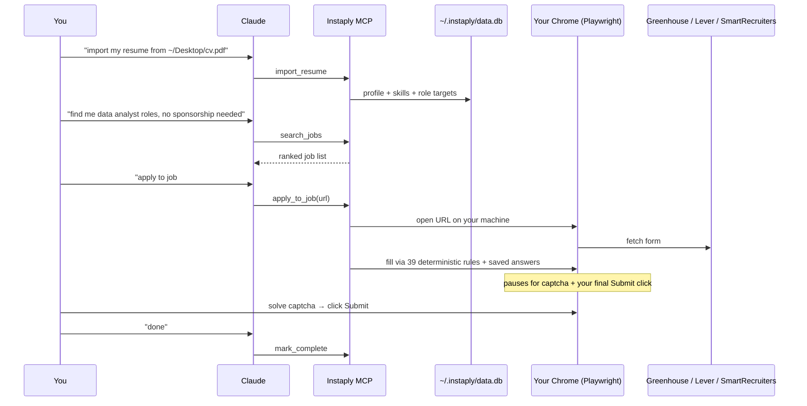

<div align="center">


<br />

[](https://pypi.org/project/instaply-mcp/)
[](LICENSE)
[](https://www.python.org/)
[](https://modelcontextprotocol.io/)
[](CONTRIBUTING.md)

**Apply to jobs from inside Claude. Your laptop, your browser, your data.**

[Install](#-install-in-30-seconds) · [How it works](#-how-it-works) · [Why this exists](#-why-this-exists) · [Privacy](#-privacy) · [Contributing](CONTRIBUTING.md)

</div>

---

## ⚡ Install in 30 seconds

Instaply ships as an **MCP server** — it plugs into Claude Desktop, Claude Code, Cursor, Codex CLI, Windsurf, Zed, and any other local MCP client.

### Claude Desktop (one click)

[**Download `instaply.mcpb`**](https://instaply.asion.ai/instaply.mcpb) → double-click → done.

(The `.mcpb` is Anthropic's official one-click bundle format. No terminal needed.)

### Claude Code

```bash
claude mcp add instaply -- uvx instaply-mcp
```

### Cursor / Windsurf / Zed / Codex CLI / anything MCP

```json
{
  "mcpServers": {
    "instaply": {
      "command": "uvx",
      "args": ["instaply-mcp"]
    }
  }
}
```

That's the whole install. Everything below happens **inside the chat** — you never run `instaply` from a terminal.

> **Heads up:** Instaply needs a real local browser. It doesn't work in Claude.ai web, ChatGPT.com, or Codex Cloud — those sandboxes can't open Chrome. By design.

---

## 💛 Why this exists

> I'm Aditya. I'm an Indian student at NYU studying Risk Analytics. Last fall I sent out **more than 1,300 job applications** because I needed visa sponsorship and most companies filter international candidates out before a human ever sees the resume.
>
> I started writing little Python scripts so I wouldn't drown. They got better. Eventually they could read job descriptions, fill forms, and click submit. I started landing interviews.
>
> For a few weeks I tried to turn this into a paid SaaS. Then I realized — **the people who need this most are the people who can least afford another monthly charge.** So I'm giving the engine away. MIT. Free forever. Runs entirely on your laptop.
>
> If it helps you land a job, that's the whole point. If you want to give back, open an issue with the title *"Got the job."* That's the only metric I track.
>
> — *Aditya Sanjay Sakhale, NYU MS Risk Analytics '26*

[Read the full story →](https://instaply.asion.ai)

---

## 🧠 How it works



Local SQLite at `~/.instaply/data.db` holds your profile, saved answers, job cache, and application history. **No Instaply server is in the loop.** No telemetry. No phoning home.

---

## 🛠️ The 12 tools Claude gets

| Tool | What it does |
|---|---|
| `import_resume` | Parse a PDF/DOCX/TXT resume into a structured profile + role targets |
| `apply_chat_update` | Natural language: "save my phone as 555-…", "mark application 3 done" |
| `update_profile` / `get_profile` | Read/write the local profile |
| `search_jobs` | Public job sources; falls back to resume-derived queries |
| `save_answer` / `list_answers` / `delete_answer` | Reusable screening answer vault |
| `apply_to_job` | Opens local Chrome, fills the form, pauses for captcha + Submit |
| `list_applications` / `get_status` | Local audit trail + counters |
| `mark_complete` | Close the loop after you click Submit |

See [`mcp/`](./mcp) for the source.

---

## 🛡️ Privacy

| What | Where | Who sees it |
|---|---|---|
| Resume + extracted profile | `~/.instaply/data.db` | Only you, plus the ATS you apply to |
| Saved screening answers | `~/.instaply/data.db` | Only you |
| Application history | `~/.instaply/data.db` | Only you |

- ❌ No telemetry
- ❌ No analytics
- ❌ No accounts to create
- ❌ No Instaply server in the apply path
- ✅ Your residential IP, your browser session, your cookies

Delete `~/.instaply/` to factory-reset. That's the whole footprint.

---

## 📦 Repo layout

```
mcp/                     # the published Python package (instaply-mcp on PyPI)
├── instaply_mcp/        # the MCP server + tools
│   ├── server.py        # MCP stdio entry point
│   ├── db.py            # local SQLite store
│   ├── runner.py        # Playwright-based form filler
│   ├── resume.py        # PDF/DOCX → structured profile
│   ├── search.py        # public job sources
│   ├── updates.py       # natural-language router
│   └── _worker/         # vendored autofill engine + ATS adapters
├── manifest.json        # .mcpb bundle metadata
├── scripts/release.ps1  # version bump + tag helper
└── README.md            # MCP-specific docs

apps/web/                # instaply.asion.ai — landing page + .mcpb host
api/                     # legacy hosted-SaaS API (deprecated, kept for reference)
worker/                  # legacy hosted worker (vendored into mcp/)
.github/workflows/       # auto-publish to PyPI + GitHub Releases on tag push
```

---

## 🔐 What still needs you

Three things Instaply will never do silently:

1. **Solve captcha.** When hCaptcha or reCAPTCHA Enterprise pops up, it pauses for you.
2. **Click Submit.** The final send is always your call.
3. **Confirm the application landed.** Look for the confirmation page / email yourself, then say "done" so it gets logged.

This is intentional. Everything else — parsing forms, filling 23+ field types, remembering your answers — is automated.

---

## 🎯 Roadmap

- [x] Greenhouse adapter
- [x] Lever adapter
- [x] SmartRecruiters adapter
- [x] MCP server (Claude Desktop / Code / Cursor / Codex / Windsurf / Zed)
- [x] `.mcpb` one-click bundle
- [x] Resume import (PDF / DOCX / text)
- [x] Job search via public sources
- [ ] Workday adapter *(in beta — Workday is hostile to automation)*
- [ ] Ashby adapter
- [ ] iCIMS adapter
- [ ] Confirmation-email tracker (Gmail OAuth)

PRs welcome for any of these. See [CONTRIBUTING.md](CONTRIBUTING.md).

---

## 🚀 For maintainers — releasing

```powershell
cd mcp
.\scripts\release.ps1 0.4.3      # bumps version + commits + tags
git push && git push --tags      # GitHub Actions takes over
```

In ~3 minutes: PyPI gets the new wheel, GitHub Release ships the `.mcpb`. See [`mcp/RELEASING.md`](./mcp/RELEASING.md).

---

## 🙏 Credits

Built by **[Aditya Sanjay Sakhale](https://github.com/Aditya-00a)** · NYU MS Risk Analytics, '26 · Founder of [Ravendise](https://asion.ai)

If Instaply helped you land a job, please [open an issue](https://github.com/Aditya-00a/Instaply/issues/new) titled *"Got the job"*. That's the only metric I care about.

If you want to support the project: [⭐ star the repo](https://github.com/Aditya-00a/Instaply). It's the cheapest way to help other students find this.

---

## 📄 License

MIT. Do whatever you want with this. See [LICENSE](LICENSE).
