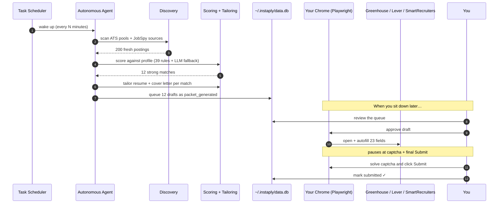

<div align="center">


<br /><br />

# 🪐 Instaply

### Job applications that happen while you sleep.

<br />

[](LICENSE)
[](https://www.python.org/)
[](https://playwright.dev/)
[](#-privacy)
[](CONTRIBUTING.md)

<br />

**[⚡ Get running](#-get-running-in-60-seconds)** · **[🧠 How it works](#-how-it-works)** · **[💛 Why this exists](#-why-this-exists)** · **[🛡️ Privacy](#%EF%B8%8F-privacy)** · **[🤝 Contributing](CONTRIBUTING.md)**

<br />

</div>

> [!TIP]
> One command sets it up. `python setup.py` auto-detects your hardware,
> installs Ollama if you don't have it, picks the right local model for
> your machine, and writes your config. About 60 seconds.

<br />

---

## ⚡ Get running in 5 commands

```bash
git clone https://github.com/Aditya-00a/Instaply
cd Instaply/agent

python setup.py                                       # detect HW + install Ollama + pick model
python setup.py profile --resume ~/Desktop/cv.pdf     # build your profile from a PDF
python setup.py doctor                                # sanity-check everything
python run.py                                         # foreground first run

# Then schedule it to run unattended (one of these)
bash scripts/setup-scheduler.sh                       # macOS / Linux
.\scripts\setup-scheduler.ps1                         # Windows
```

Under 5 minutes on a fresh laptop. Each step is opinionated and gets out of your way:

| Command | What it does |
|---|---|
| `python setup.py` | Detects your OS / RAM / GPU. Installs Ollama via `brew` / `winget` / `curl`. Picks the right local model for your hardware (3B → 70B). Writes `config/.env`. |
| `python setup.py profile` | Walks ~15 questions (identity, contact, work auth, target roles, optional EEO). Pass `--resume <path>` to autopopulate from a PDF / DOCX. Writes `data/profile.json` + `data/master-resume.json`. |
| `python setup.py doctor` | Runs 10 health checks (Python version, deps, Ollama up, model pulled, Playwright Chromium, profile valid, SQLite writable). Tells you the exact fix for any failure. |
| `python run.py` | Starts the autonomous loop in the foreground. Discovers, scores, tailors, drafts. Hit Ctrl-C anytime. |
| `setup-scheduler.{sh,ps1}` | Installs it as a scheduled task (macOS launchd / Linux cron / Windows Task Scheduler). Idempotent, has `status` / `remove` / `start` / `stop` subcommands. |

After the scheduler is in, you sleep. The loop wakes up every 30 min,
discovers fresh jobs across Greenhouse / Lever / SmartRecruiters /
JobSpy sources, scores them against your profile, drafts tailored
applications, and queues them. You wake up to a queue of drafts ready
to review and submit.

> [!IMPORTANT]
> Instaply runs on **your laptop**, with **your IP**, **your cookies**,
> and **your local LLM**. Nothing in the apply path touches an Instaply
> server. There is no Instaply server.

<br />

---

## 💛 Why this exists

> Sending hundreds of job applications by hand is broken. Most never
> reach a human. The few that do are filtered before anyone reads them.
> Existing automation tools want $30–80/month to fill a form on your
> behalf, and they do it from a datacenter IP that gets bot-detected
> within seconds.
>
> Instaply takes the opposite shape. It's a **local-first** agent that
> runs on the machine you already own, fills out applications with
> **your real browser**, and pauses for **you** to solve the captcha
> and click submit. MIT licensed, no subscriptions, no telemetry, no
> servers in the loop. **Free forever.**
>
> If it helps you land a role, [open an issue titled "Got the job"](https://github.com/Aditya-00a/Instaply/issues/new). That's the only metric that matters.

<br />

---

## 🧠 How it works

<div align="center">

</div>

<br />

A typical day, end-to-end:



The agent never silently submits anything. The autofill engine fills
**~80% of fields with deterministic rules**, falls back to your local
LLM for the gnarly 20%, and **always stops at the captcha + the Submit
button** for you to verify.

<br />

---

## 🆚 vs the alternatives

|  | 🪐 **Instaply** | 💸 Paid SaaS agents | 🪟 Browser extensions |
|---|:---:|:---:|:---:|
| **Price** | **$0** · MIT | $30–80 / month | Often free, then upsell |
| **Captcha** | ✅ You solve, in your own browser | ❌ Bot detection often blocks | ⚠️ Inconsistent |
| **Your data** | ✅ Local SQLite, zero servers | ☁️ Their cloud | ☁️ Their cloud |
| **Source code** | ✅ MIT, on GitHub | ❌ Closed | ❌ Closed |
| **Runs while you sleep** | ✅ Background loop | ✅ But: cloud-side | ❌ Only when you click |
| **Account required** | ❌ None | ✅ Always | ✅ Usually |
| **Picks the right LLM for your hardware** | ✅ Setup wizard | n/a | n/a |

<br />

---

## 🛠️ What it does

<table>
<tr><th align="left">Capability</th><th align="left">How</th></tr>
<tr><td><b>Job discovery</b></td><td>Polls Greenhouse, Lever, SmartRecruiters slug pools + JobSpy aggregators (LinkedIn, Indeed, Glassdoor) on schedule</td></tr>
<tr><td><b>Scoring</b></td><td>39 deterministic field rules + LLM fallback for ambiguous fits; weighted by your profile, target roles, sponsorship requirements</td></tr>
<tr><td><b>Resume tailoring</b></td><td>Per-job re-ranking of bullets and projects against the JD, controlled by <code>config/resume_rules.json</code></td></tr>
<tr><td><b>Cover letter drafting</b></td><td>Local LLM, conservative prompt with the candidate's grounded experience</td></tr>
<tr><td><b>Form autofill</b></td><td>Playwright opens your Chrome, fills 23+ standard fields, pauses for captcha and final submit</td></tr>
<tr><td><b>Queue + audit</b></td><td>Local SQLite at <code>~/.instaply/data.db</code> — every job, every decision, every screenshot</td></tr>
<tr><td><b>Confirmation tracking</b></td><td>Optional Gmail OAuth to match employer reply emails back to applications</td></tr>
<tr><td><b>Self-restart</b></td><td>Watchdog script keeps the loop alive across crashes and reboots</td></tr>
</table>

<br />

---

## 🛡️ Privacy

<table>
<tr>
<th align="left">What</th>
<th align="left">Where</th>
<th align="left">Who sees it</th>
</tr>
<tr><td>Resume + extracted profile</td><td><code>agent/data/profile.json</code> + <code>master-resume.json</code></td><td>Only you, plus the ATS you apply to</td></tr>
<tr><td>Saved screening answers</td><td><code>agent/data/jobs.db</code></td><td>Only you</td></tr>
<tr><td>Application history + screenshots</td><td><code>agent/data/jobs.db</code> + <code>artifacts/</code></td><td>Only you</td></tr>
<tr><td>LLM calls</td><td>Your local Ollama (default) or your own API key</td><td>You + your model provider</td></tr>
</table>

<table>
<tr>
<td width="50%">

#### ❌ What Instaply doesn't do
- No telemetry
- No analytics pings
- No accounts
- No Instaply server in the apply path (there is no Instaply server)
- No tracking cookies
- No third-party scripts

</td>
<td width="50%">

#### ✅ What Instaply does
- Stores everything in local SQLite + JSON
- Uses your residential IP + your cookies + your real Chrome profile
- Lets you `rm -rf agent/data/` to factory-reset
- Pauses for **your** captcha + **your** Submit click
- Ships every line under MIT
- Lets you read [the source](./agent/) before you trust it

</td>
</tr>
</table>

<br />

---

## 📦 Repo layout

```
agent/                    # 🤖 the autonomous engine
├── run.py                # ├─ the persistent discovery + apply loop
├── apply_now.py          # ├─ single-job worker (called by run.py + manually)
├── setup.py              # ├─ cross-platform setup wizard
├── find_wd_job.py        # ├─ Workday discovery (beta)
├── jobspy_search.py      # ├─ JobSpy aggregator wrapper
├── backend/              # ├─ services the loop depends on
│   ├── services/         # │  ├─ auto_apply, application_pipeline, tailor, …
│   ├── db/               # │  ├─ jobs repository
│   ├── models/           # │  ├─ pydantic schemas
│   └── prompts/          # │  └─ LLM prompt templates
├── config/               # ├─ env + design tokens + resume rules
├── data/                 # ├─ company pools (your profile lives here)
└── scripts/              # └─ scheduler setup, watchdog, gmail tracker

apps/web/                 # 🌐 instaply.asion.ai — landing page
.github/                  # 🤖 issue templates, banner, architecture diagram
LAUNCH.md                 # 🚀 launch playbook (GitHub setup + announce)
```

<br />

---

## 🔐 What still needs you

Three things Instaply will never do silently — by design:

<table>
<tr>
<td width="33%" align="center">

### 🧩
**Solve captcha**

When hCaptcha or reCAPTCHA Enterprise pops up, the agent pauses and waits for you.

</td>
<td width="33%" align="center">

### 👆
**Click final Submit**

The last button press is always your call. The browser stays open
after autofill and waits for you. Press Enter in the terminal when
done. Set `INSTAPLY_AUTO_CLOSE=1` to skip the wait for unattended runs.

</td>
<td width="33%" align="center">

### 📨
**Confirm landing**

Look for the confirmation page yourself, then mark it done so it gets logged.

</td>
</tr>
</table>

Everything else (parsing forms, filling 23+ field types, remembering your
saved answers, scoring jobs, scheduling the loop, tailoring per JD) is
automated.

<br />

---

## 🎯 Roadmap

<table>
<tr>
<td width="50%" valign="top">

#### ✅ Shipped
- Greenhouse adapter
- Lever adapter
- SmartRecruiters adapter
- Cross-platform setup wizard with hardware detection
- Auto-install Ollama + auto-pick model
- Windows scheduled-task install
- Background watchdog + auto-restart
- Resume tailoring engine (39 field rules + LLM fallback)
- Local SQLite audit trail

</td>
<td width="50%" valign="top">

#### 🚧 In flight / planned
- Profile wizard (replace manual JSON editing)
- Workday adapter (in beta — Workday is hostile to automation)
- Ashby + iCIMS adapters
- macOS launchd + Linux cron scheduler scripts
- Confirmation-email tracker (Gmail OAuth)
- Local web review dashboard at `localhost:3001`

</td>
</tr>
</table>

PRs welcome for any of these. See [CONTRIBUTING.md](CONTRIBUTING.md) for
good first issues.

<br />

---

## 📈 Star history

<a href="https://star-history.com/#Aditya-00a/Instaply&Date">
  <picture>
    <source media="(prefers-color-scheme: dark)" srcset="https://api.star-history.com/svg?repos=Aditya-00a/Instaply&type=Date&theme=dark" />
    <source media="(prefers-color-scheme: light)" srcset="https://api.star-history.com/svg?repos=Aditya-00a/Instaply&type=Date" />
    
  </picture>
</a>

<br /><br />

---

<div align="center">

### If Instaply helped you land a job…

[**Open an issue titled "Got the job"**](https://github.com/Aditya-00a/Instaply/issues/new) — it's the only metric that matters.

### If you want to support the project…

[**⭐ Star the repo**](https://github.com/Aditya-00a/Instaply) — it's the cheapest way to help other students find this.

<br />

---

📄 **MIT licensed.** Do whatever you want with this. See [LICENSE](LICENSE).

<br />

<sub>Built with Python, Playwright, and a complete refusal to charge anyone $30/month to fill a form.</sub>

</div>
